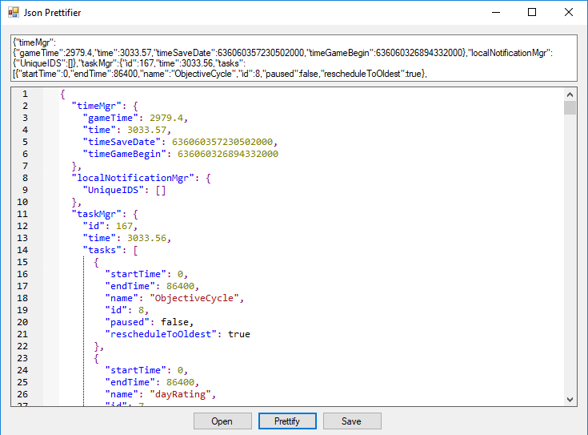

# PrettyJason
**Uses a modified version of EasyScintilla since it didn't have a json styler**

Modified version is available at https://github.com/SammyJ/EasyScintilla

------

Have ugly json? Worry no longer, this tool will make working with it much more bearable.

------

#### Credits

[adam8797](https://github.com/adam8797) - Original EasyScintilla

[JamesNK](https://github.com/JamesNK/Newtonsoft.Json) - Newtonsoft.Json

